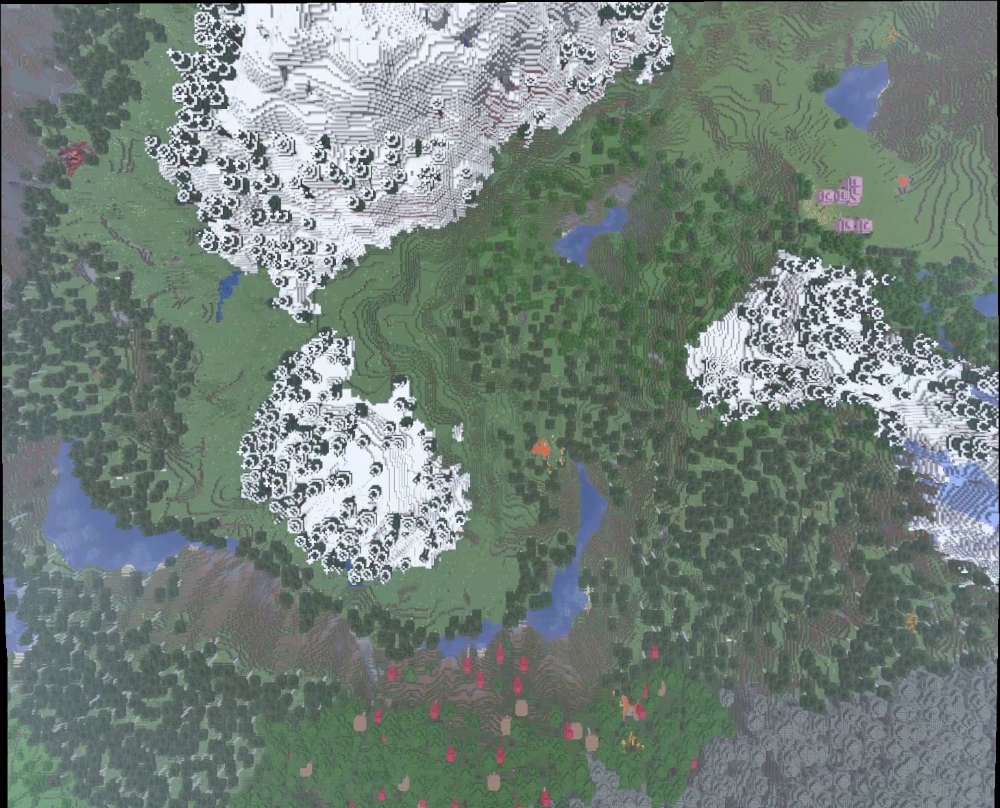
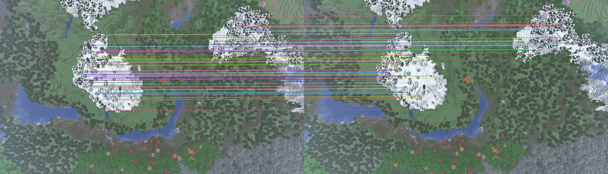
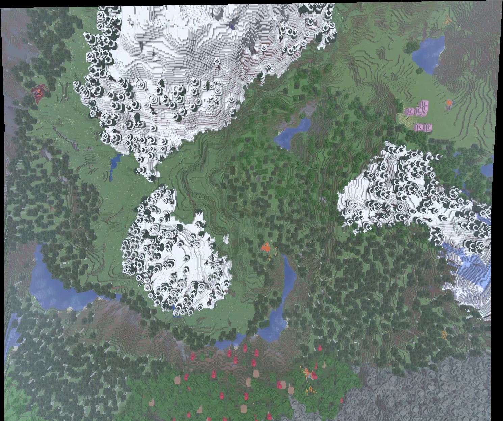

# UAVs-Berkeley-GSchool
Repo for the UAVs @ Berkeley ground school.

## Skill Booster 1: "I'll be Needin' Stitches"

Takes a video of a Minecraft creative-mode flight, with the camera looking straight down at the terrain, and stitches its frames into one large image of the whole flight path. It's the same idea as a drone orthophoto.



*31 frames stitched with the custom pipeline (ORB features, partial affine transforms). The camera flew "up" the image, so the top part shows terrain that isn't in the first frame.*

### Contents

| File | What it does |
|---|---|
| [`frame_extraction.py`](frame_extraction.py) | Reads the video and keeps every Nth frame. Can also save them to `frames/` for inspection. |
| [`baseline_stitcher.py`](baseline_stitcher.py) | Baseline: OpenCV's built-in `cv2.Stitcher` in SCANS or PANORAMA mode. |
| [`stitch.py`](stitch.py) | The custom pipeline: features → matches → transforms → canvas → mosaic, plus stats. |
| [`results/`](results/) | Output images shown in this README. |
| [`requirements.txt`](requirements.txt) | Pinned dependencies (`opencv-python`, `numpy`). |

### Setup

Tested with Python 3.12 on Linux.

```bash
python3 -m venv .venv
source .venv/bin/activate
pip install -r requirements.txt
```

The input video (`Minecraft_stitch_test.mp4`, 26 MB) is **not in the repo**. It's the video provided with the assignment. Put it in the repo root. The `.gitignore` already excludes `*.mp4`.

### How to run

```bash
# 1. Look at a few sampled frames (written to frames/)
python frame_extraction.py Minecraft_stitch_test.mp4 -n 10 -s 0.5 --limit 8

# 2. Baseline with OpenCV's built-in stitcher
python baseline_stitcher.py Minecraft_stitch_test.mp4 -o results/baseline_scans.jpg

# 3. Custom pipeline (defaults: ORB, partial affine, every 10th frame, half size)
python stitch.py Minecraft_stitch_test.mp4 -o results/stitched_orb.jpg --draw-matches results/matches_orb.jpg

# Variants
python stitch.py Minecraft_stitch_test.mp4 --method sift -o results/stitched_sift.jpg
python stitch.py Minecraft_stitch_test.mp4 --model homography -o results/stitched_orb_homography.jpg
```

Main options for `stitch.py` (run `python stitch.py -h` for all):

| Option | Default | Meaning |
|---|---|---|
| `-n, --every-n` | 10 | Keep frame `i` only if `i % N == 0` |
| `-s, --scale` | 0.5 | Resize frames before processing (0.5 ran about 2× faster than full size here) |
| `--method` | `orb` | Feature detector: `orb` or `sift` |
| `--features` | 3000 | Max keypoints per frame |
| `--ratio` | 0.75 | Lowe ratio test threshold |
| `--model` | `partial` | Transform: `partial`, `affine` or `homography` |
| `-o, --output` | `results/stitched.jpg` | Where to write the mosaic |
| `--draw-matches` | off | Also save a picture of the first pair's matches |

Example output:

```
        pair keypoints   good inliers  status
       0->10      3000   1910    1853  ok
      10->20      3000   1894    1843  ok
         ...
frames sampled : 31
frames used    : 31
failed pairs   : 0
good matches   : mean 1844, min 1696
inliers        : mean 1747, min 1359
last frame     : shift (-10, -348) px, scale 1.010, rotation -0.20 deg
canvas         : 1459x1180
time           : 6.7 s
```

### Approach

**1. Frame extraction.** `cv2.VideoCapture` + `cap.read()` decode the video one frame at a time. Every frame still has to be decoded, because compressed video stores most frames as differences from earlier ones. Only frames where `index % N == 0` are kept. At 30 fps, consecutive frames are almost identical, so skipping frames saves work without losing coverage. The frames are yielded by a generator, so the whole video never sits in memory at once.

**2. Features.** ORB (by default) finds corner-like keypoints in each frame and describes the patch around each one with a 256-bit binary string. SIFT is the alternative: its descriptors are float vectors, which are slower to compute but more robust to scale and lighting changes.

**3. Matching.** A brute-force matcher finds each keypoint's two nearest neighbours in the previous frame. It uses Hamming distance for ORB and L2 distance for SIFT. **Lowe's ratio test** keeps a match only if the best neighbour is clearly closer than the second best (`d1 < 0.75 · d2`). Minecraft terrain repeats the same block textures everywhere, so this step matters: it throws away ambiguous matches.



*First 100 matches that pass the ratio test, between two consecutive sampled frames. All the lines are parallel, which means one consistent shift.*

**4. Transform between consecutive frames.** RANSAC fits the model to random subsets of matches and keeps the fit that most matches agree with (the inliers, within 3 px). That makes it robust to the wrong matches that survive the ratio test. There are three model options:

| Model | OpenCV call | Degrees of freedom | What it can represent |
|---|---|---|---|
| **Partial affine** (default) | `estimateAffinePartial2D` | 4 | Translation, rotation, uniform scale |
| Affine | `estimateAffine2D` | 6 | Also shear and non-uniform scale |
| Homography | `findHomography` | 8 | Full perspective (the camera tilting) |

For a camera pointing **straight down** at roughly flat ground, consecutive frames differ by a slide, a turn and maybe a small zoom from altitude changes. That is exactly the partial affine model. Shear, and the perspective terms of a homography, only appear if the camera tilts. Giving the model those extra degrees of freedom doesn't make it more accurate. It lets it fit noise and 3D parallax, and those small errors **compound** when the transforms are chained (see the results below). A homography is the right choice when the camera is tilted or the view is at an angle.

**5. Chaining.** Each pair gives `M_i`, which maps frame `i` into frame `i-1`. To place every frame in frame 0's coordinates, the transforms are multiplied along the chain:

```
T_0 = I
T_i = T_(i-1) · M_i
```

If a pair has fewer than 20 inliers, it counts as failed: that frame is skipped, and the next frame is matched against the last frame that was placed.

**6. Canvas and overlay.** The four corners of every frame are transformed by `T_i` to find the bounding box of the whole mosaic. A translation `offset` shifts that box so its top-left corner is at (0, 0), because frames placed above or left of frame 0 have negative coordinates. Each frame is warped with `cv2.warpPerspective(frame, offset · T_i)` and copied onto the canvas; later frames overwrite earlier ones. A warped white mask marks which pixels a frame covers fully, so the interpolated edge pixels, which are half black, don't leave dark seam lines.

### Results

The video is 2880×1652, 30 fps, 303 frames (10 s). Before stitching, I measured the camera motion with phase correlation (an FFT-based estimate of the shift between two images). The camera moves straight along one axis: about **676 px in total at full resolution, with almost no sideways motion**. That's less than half a frame height over the whole flight, so a correct mosaic should be about **1.4× taller than one frame and the same width**. The good results below match that expectation.

**Baseline (`cv2.Stitcher`):**

| Mode | Result |
|---|---|
| SCANS | ✅ Works. 31 frames, 1447×1167 mosaic, about 13 s. Clean seams: it uses multi-band blending and runs a global bundle adjustment over all the frames. |
| PANORAMA | ❌ Fails, out of memory. Even 8 frames try to allocate a 2 GB canvas. |

PANORAMA assumes the camera **rotates in place** (like a phone panorama) and estimates the focal length from how much it turned. Our camera slides without rotating, so the estimated focal length blows up, and with it the spherical canvas. SCANS assumes an affine model, which fits a top-down camera.


**Custom pipeline.** Every 10th frame at half size unless noted. Times are on a 16-thread laptop CPU.

| Config | Frames used | Failed pairs | Mean inliers / pair | Last-frame shift (px) | Last-frame scale | Last-frame rotation | Canvas | Time |
|---|---|---|---|---|---|---|---|---|
| **ORB, partial** | 31/31 | 0 | 1747 | (−10, −348) | 1.010 | −0.20° | 1459×1180 | 6.7 s |
| SIFT, partial | 31/31 | 0 | 1818 | (−9, −353) | 1.011 | −0.01° | 1457×1180 | 8.6 s |
| ORB, affine | 31/31 | 0 | 1738 | (−1, −385) | 1.041 | −0.24° | 1442×1218 | 5.5 s |
| ORB, homography | 31/31 | 0 | 1792 | (−12, −394) | 1.058 | −0.57° | 1490×1247 | 5.5 s |
| ORB, partial, N=30 | 11/11 | 0 | 1158 | (−9, −333) | 1.004 | −0.64° | 1456×1176 | 3.2 s |
| ORB, partial, full size | 31/31 | 0 | 1231 | (−20, −692) | 1.008 | −0.37° | 2916×2363 | 12.7 s |

The "last frame" columns show where the final frame landed relative to frame 0. For this straight, level flight, the ideal values are a vertical shift of about −338 px at half size (−676 px at full size), with scale 1.0 and rotation 0°. Anything else is accumulated drift. The phase-correlation reference only measures translation, so treat it as a sanity check, not ground truth.



*Homography model: the mosaic turns into a trapezoid, because small perspective errors compound over 30 chained transforms.*

### What worked

- **The custom pipeline works on this video**: every frame placed and no failed pairs in any configuration. The ORB/partial affine result is visually on par with `cv2.Stitcher` SCANS, in about half the time.
- **Partial affine was the right model.** Its drift was the smallest: shift within about 3% of the phase-correlation estimate, scale 1.01, rotation 0.2°. Affine (1.04 scale) and homography (1.06 scale, visible keystone) were both worse, which is the chained-error effect described above.
- **SIFT vs ORB**: SIFT drifted slightly less in rotation (0.01° vs 0.20°) and found more inliers, at about 30% more time. On this texture-rich terrain both are more than enough.
- **Ratio test + RANSAC** kept about 95% of the ratio-test matches as inliers on average (80% in the worst pair), even on repetitive block textures.
- **Working at half size** gave the same geometry as full size, about twice as fast.

### What didn't work / limitations

- **The flight is short.** The camera travels less than half a frame, so the mosaic is only 1.4× one frame. The input was fixed for the assignment, so the pipeline couldn't be tested on long flights, turns or 2D survey patterns, which is where drift really shows.
- **PANORAMA mode** crashes, and the **homography** model distorts the mosaic. Both are wrong motion models for a top-down camera.
- **No blending.** Frames just overwrite each other ("last frame wins"). Minecraft has no exposure changes, so the seams are barely visible here, but real drone footage would show brightness steps at the frame edges.
- **The terrain isn't flat.** Mountains and trees are closer to the camera than the ground, so they move faster across the screen (parallax). A single 2D transform can't model that. The scale of 1.01 seen with both ORB and SIFT may come from parallax or a slight altitude change; without ground truth I can't tell which.
- **The keypoints aren't evenly spread.** ORB puts most of them on the high-contrast snow (see the matches image), so those areas dominate the fit.
- **Pure chaining.** Each frame is matched only against the previous one, so errors only ever add up. Nothing corrects them.

### Ideas for improvement

**Drift**
- Match each frame against several earlier frames, or against the mosaic itself, not just the previous frame.
- **Loop closure + global optimization (bundle adjustment):** when the drone flies back over a spot it has already seen, add that match as a constraint and solve for all transforms together, spreading the error across the whole chain instead of letting it pile up.
- Use the drone's **GPS/IMU telemetry** as a prior for each frame's position, and use image matching only to refine it.
- Choose keyframes by measured overlap (for example, add a frame when overlap drops below 70%) instead of a fixed N.

**Blending**
- **Feathering:** weight each pixel by its distance to the frame edge, so overlaps fade instead of cutting hard.
- **Multi-band blending** (`cv2.detail.MultiBandBlender`) plus **seam finding** and **exposure compensation**. `cv2.Stitcher` uses multi-band blending and seam finding internally, which is why its seams look clean.

**Real-time on a drone**
- The pipeline is already incremental: each frame only needs the previous one, so it could run as frames arrive.
- Stay with ORB (fast, binary descriptors) at reduced resolution, and use a GPU (`cv2.cuda`, or a Jetson on board) for detection and matching.
- Use telemetry to predict where the next frame lands and search for matches only near there, which is much cheaper than brute force.
- Store the mosaic as tiles instead of one giant array, so memory doesn't grow with flight length. Stream the tiles to the ground station.
- For real mapping, **orthorectify** with a terrain elevation model, so hills and buildings are projected correctly instead of approximated by a flat plane.
